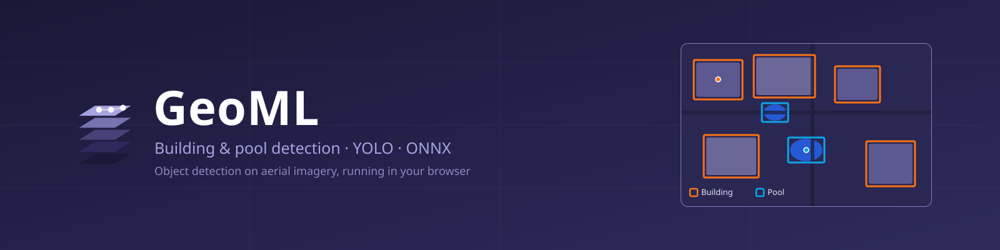
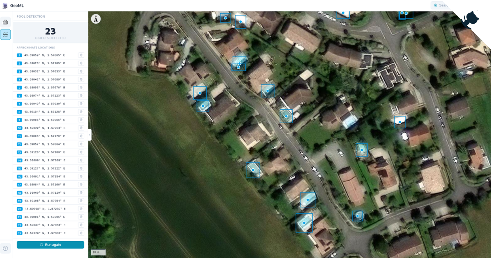

<div align="center">

  

  <h1>Geospatial ML <br> From model training to interactive map</h1>
  <h3>Building & pool detection on aerial imagery - YOLO models running in your browser</h3>  
  <p>
    <a href="https://github.com/tristan-greffe/machine-learning/stargazers">
      
    </a>
    <a href="https://github.com/tristan-greffe/machine-learning/blob/master/LICENSE">
      
    </a>
    <a href="https://tristan-greffe.github.io/geo-ml/">
      
    </a>
    <a href="https://tristan-greffe.github.io/geo-ml/documentation/">
      
    </a>
  </p> 
  <h4>
    <a href="https://tristan-greffe.github.io/geo-ml/">View Online</a>
    <span> · </span>
    <a href="https://tristan-greffe.github.io/geo-ml/documentation/">View Documentation</a>
    <span> · </span>
    <a href="https://github.com/tristan-greffe/geo-ml/issues/">Report Bug</a>
  </h4>
</div>

<div align="center">
  
</div>

## Tech Stack

**Frontend**  
[](https://react.dev)
[](https://vite.dev)
[](https://maplibre.org)
[](https://onnxruntime.ai/docs/tutorials/web/)

**Model**  
[](https://python.org)
[](https://pytorch.org)
[](https://docs.ultralytics.com)
[](https://onnx.ai)

**Docs**  
[](https://vitepress.dev)

## Getting Started

Run the web app locally:
```bash
cd frontend
npm install
npm run dev
```

> [!NOTE]
> the ONNX models in `frontend/public/models/` load straight in the browser. Training the models (Python / Ultralytics) is optional and covered in the [documentation](https://tristan-greffe.github.io/geo-ml/documentation/).

## Contributing

Contributions are welcome. See the [contributing guide](https://tristan-greffe.github.io/geo-ml/documentation/about/contributing.html) in the documentation.

## License

This project is licensed under the MIT License - see the [license file](./LICENSE) for details
