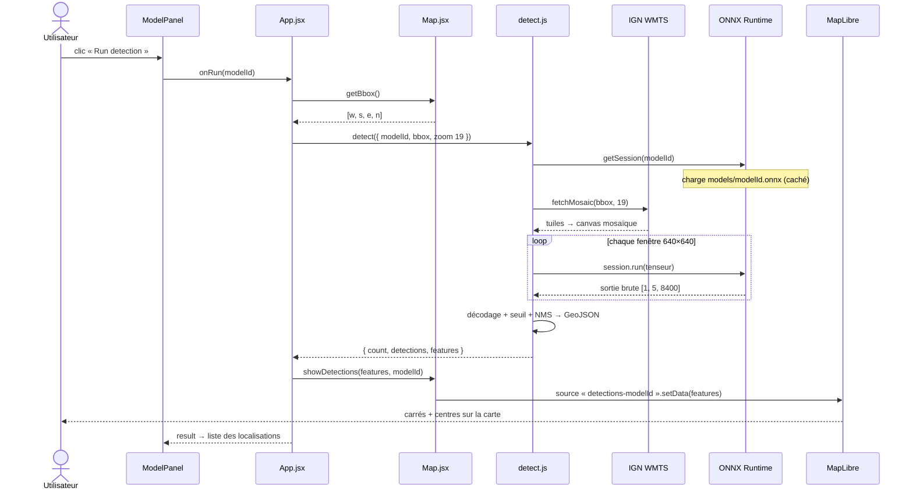
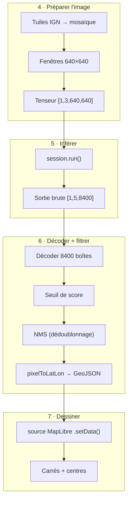

# Inférence

geo-ml est livré **sans backend**. La détection tourne entièrement dans le navigateur via [ONNX Runtime Web](https://onnxruntime.ai/docs/get-started/with-javascript/web.html). Tout se passe coté client et les détections ne quittent jamais la machine de l'utilisateur.


## Processus

Un clic sur **Run detection** déclenche une chaîne qui traverse sept acteurs : du composant React qui héberge le bouton jusqu'aux couches [MapLibre](https://maplibre.org/) qui dessinent les boîtes englobante.



### 1. Le bouton se déverrouille - `ModelPanel`

Le bouton **Run detection** n'est cliquable que si la zone est exploitable. `ModelPanel` lit les conditions dans `RUN_CONDITIONS` (voir [Aperçu](./overview.md#config)) et calcule un booléen `canRun` :

```js
const canRun = zoom >= minZoom && basemap === requiredBasemap && modelAvailable
```

Trois garde-fous, chacun avec son indice affiché sous le bouton :

| Condition | Pourquoi | Indice si non remplie |
| --- | --- | --- |
| `zoom >= 18` | En dessous, la zone visible couvre trop de terrain pour des objets de quelques mètres | *Zoom in more…* |
| `basemap === 'satellite'` | Les modèles sont entraînés sur orthophotos, pas sur des fonds vectoriels | *Switch to satellite view first* |
| `modelAvailable` | Le `.onnx` doit exister sur le serveur (`isModelAvailable` fait un `HEAD`) | *Model not trained yet* |

Au clic, `handleRun` passe le panneau en état `running` (le spinner s'affiche) puis appelle `onRun(modelId)`, câblé par `App.jsx`.

### 2. La zone visible devient une bbox - `App.jsx` + `Map.jsx`

`App.handleRun` demande à la carte son cadre visible, puis lance le pipeline :

```js
async function handleRun(modelId) {
  const bbox = mapRef.current?.getBbox()        // [w, s, e, n] en degrés WGS84
  const result = await detect({ modelId, bbox, zoom: 19 })
  mapRef.current?.showDetections(result.features, modelId)
  return result
}
```

`getBbox()` est l'une des méthodes impératives exposées par `Map.jsx` via `useImperativeHandle` ; elle renvoie `[west, south, east, north]` à partir de `map.getBounds()`.

:::tip Pourquoi `zoom: 19` alors que le bouton s'ouvre à 18 ?
Le **zoom carte** (≥ 18) garantit seulement que la zone visible est assez petite. Le **zoom des tuiles** passé à `detect` est figé à `19`, le niveau de résolution maximale de l'IGN (~20 cm/pixel). On infère donc toujours à pleine résolution, indépendamment du niveau d'affichage de l'utilisateur.
:::

### 3. `detect()` orchestre le pipeline - `detect.js`

`detect.js` est le **point d'entrée unique**. Il enchaîne les quatre modules spécialisés et renvoie un résultat prêt pour la carte :

```js
const result = await detect({
  modelId: 'buildings',   // 'buildings' | 'pools'
  bbox: [w, s, e, n],     // degrés WGS84
  zoom: 19                // zoom des tuiles IGN
})
// result : { model, count, detections: [{ lat, lon, score }], features: FeatureCollection }
```

| Étape dans `detect.js` | Module | Rôle |
| --- | --- | --- |
| `getSession(modelId)` | `runtime.js` | Charge et met en cache la session ONNX |
| `fetchMosaic(bbox, zoom)` | `tiles.js` | Télécharge et assemble les tuiles IGN |
| `iterWindows(canvas)` | `preprocess.js` | Découpe en fenêtres 640, produit les tenseurs |
| `session.run(...)` | `runtime.js` | Inférence YOLOv8, sortie `[1, 5, 8400]` |
| `decodeDetections` + `nms` | `postprocess.js` | Décode, filtre par score, dédoublonne |

Les étapes 4 à 7 forment le **pipeline de données** : elles transforment progressivement des pixels en carrés affichables. Voici le voyage d'une zone, de la photo aérienne jusqu'à la carte :



### 4. Tuiles → mosaïque → tenseurs - `tiles.js` + `preprocess.js`

**Le modèle ne voit pas la carte ; il voit des images.** Cette étape télécharge la photo aérienne de la zone visible et la découpe en imagettes carrées que le modèle sait lire.

`tiles.js` convertit la bbox en tuiles, les télécharge en parallèle et les assemble en une grande image, la **mosaïque**. `preprocess.js` la découpe ensuite en **fenêtres de 640×640 pixels** qui se chevauchent un peu, et transforme chaque fenêtre en **tenseur**.


:::info C'est quoi un tenseur ?
Un **tenseur** est un tableau de nombres à plusieurs dimensions, la structure de données universelle du machine learning. Une fenêtre couleur de 640×640 devient un tenseur de forme `[1, 3, 640, 640]` :

- `3` : trois plans de couleur (rouge, vert, bleu) ;
- `640 × 640` : pour chaque plan, une grille de valeurs de luminosité ;
- `1` en tête : la taille du **lot** (batch), ici une seule image à la fois.

`CHW` signifie que les **C**anaux passent avant la **H**auteur et la largeur (**W**idth), l'ordre attendu par ONNX. `float32 [0, 1]` : chaque valeur de pixel (0–255) est divisée par 255. C'est exactement le format vu à l'entraînement.
:::

:::tip Pourquoi des fenêtres qui se chevauchent ?
La mosaïque dépasse souvent 640 px de côté. On la balaie donc par **fenêtres glissantes** avec 20 % de chevauchement (`iterWindows`) : un objet à cheval sur une bordure apparaît entier dans au moins une fenêtre. Les doublons que cela crée sont éliminés plus tard par le NMS (étape 6).
:::

### 5. Le modèle infère - `runtime.js`

**Chaque fenêtre passe dans le modèle**, qui répond par une longue liste de boîtes candidates, pour l'essentiel du bruit à filtrer.

`detect.js` enveloppe le tenseur dans un `ort.Tensor` et appelle `session.run`. La session ONNX est chargée à la première détection, puis gardée en mémoire.

:::tip Lazy loading
Le premier appel à `detect({ modelId })` télécharge le `.onnx` correspondant, environ 6 MB (`yolov8n`) ou 22 MB (`yolov8s`). Les appels suivants réutilisent l'`InferenceSession` en mémoire, et le fichier reste dans le cache HTTP du navigateur.
:::

:::info À quoi ressemble la sortie ?
Pour chaque fenêtre, le modèle renvoie un tenseur de forme `[1, 5, 8400]` : **8400 boîtes candidates**, décrites chacune par 5 nombres, `cx, cy` (centre), `w, h` (taille) et un **score de confiance**. La plupart ont un score quasi nul : ce sont des emplacements où le modèle n'a rien vu. C'est le format YOLOv8 exporté avec `nms=False` (voir [ONNX](../models/onnx.md)).
:::

### 6. Décodage + NMS → GeoJSON - `postprocess.js`

**On fait le tri.** Parmi les 8400 candidates, on jette les boîtes peu sûres, on fusionne les doublons, et on convertit les survivantes en coordonnées géographiques.

`decodeDetections` ne garde que les boîtes dépassant le seuil de score, puis `nms` supprime les doublons. Enfin, chaque boîte est reprojetée en latitude/longitude par `pixelToLatLon`.

:::tip Pourquoi le NMS est en JavaScript
Le `.onnx` est exporté avec `nms=False` (voir [Entraînement](../models/train.md)) car l'opération NMS est mal supportée par ONNX Runtime Web. On la réimplémente donc ici, ce qui garantit la compatibilité avec toutes les versions du runtime.
:::

:::info NMS et IoU, en bref
Après le seuil de score, plusieurs boîtes décrivent souvent le **même** objet (à cause du chevauchement des fenêtres). Le **NMS** (Non-Maximum Suppression) ne garde que la meilleure : il trie par score, puis supprime toute boîte qui recouvre une meilleure à plus de 45 %. Ce taux de recouvrement est l'**IoU** (Intersection over Union), le rapport entre la surface commune et la surface totale de deux boîtes (voir [YOLO](../models/yolo.md)).
:::

Chaque boîte finale produit **deux features GeoJSON** :

- un **Polygon** (`kind: 'bbox'`) : les quatre coins du carré en WGS84 ;
- un **Point** (`kind: 'center'`) : le centre de la boîte, sa localisation approximative.

`detect.js` les emballe dans une `FeatureCollection` et renvoie `{ model, count, detections, features }`.

### 7. Les carrés apparaissent - `Map.jsx` + MapLibre

**La carte dessine le résultat.** Les coordonnées sont envoyées à MapLibre, qui trace un carré et un point pour chaque détection.

`showDetections` pousse la `FeatureCollection` dans la **source** MapLibre du modèle ; mettre à jour cette source suffit pour que la carte se redessine.

```js
showDetections: (featureCollection, modelId) => {
  const src = map.current?.getSource(`detections-${modelId}`)
  if (src) src.setData(featureCollection ?? EMPTY_FC)
}
```

:::tip Comment le GeoJSON devient des formes
Chaque modèle possède **deux couches** MapLibre, créées à l'initialisation de la carte (les clés viennent de `MODEL_COLORS`). Elles filtrent la même source selon la propriété `kind` :

| Couche | Type | Filtre | Rendu |
| --- | --- | --- | --- |
| `detections-<id>-box` | `line` | `kind == 'bbox'` | Le **contour du carré** (couleur `outline`) |
| `detections-<id>-center` | `circle` | `kind == 'center'` | Le **point central** (couleur `fill`) |

Les couleurs viennent de `MODEL_COLORS` : orange pour les bâtiments, bleu pour les piscines.
:::

En parallèle, `ModelPanel` passe en état `done` et affiche le nombre d'objets détectés et la liste de leurs localisations approximatives. Un nouveau clic sur **Run again**, ou `clearShapes()`, réinjecte une collection vide et efface les carrés.

## Ajouter un nouveau modèle

1. Entraîner et exporter le modèle : `python model/train.py --model <name>`.
2. Le script dépose `frontend/public/models/<name>.onnx`.
3. Ajouter une entrée à `MODELS` et `MODEL_COLORS` dans `frontend/src/config.js` (voir [Aperçu](./overview.md#config)).
4. Si le pré/post-traitement diffère (autre résolution, autre format de sortie), adapter `detect.js`.
