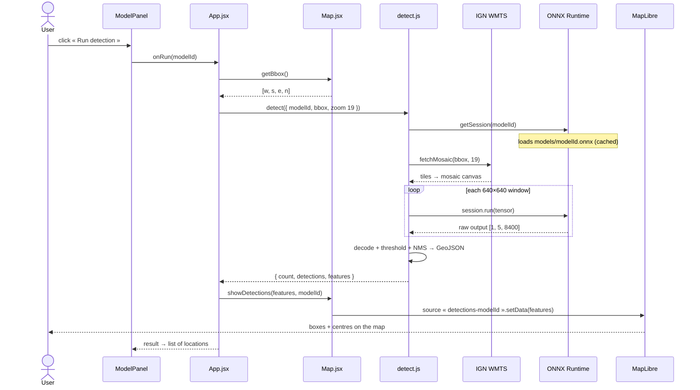
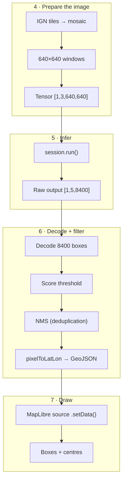

# Inference

geo-ml ships **without a backend**. Detection runs entirely in the browser via [ONNX Runtime Web](https://onnxruntime.ai/docs/get-started/with-javascript/web.html). Everything happens client-side and the detections never leave the user's machine.


## Process

A click on **Run detection** triggers a chain that travels through seven actors: from the React component that hosts the button to the [MapLibre](https://maplibre.org/) layers that draw the bounding boxes.



### 1. The button unlocks - `ModelPanel`

The **Run detection** button is only clickable when the area is usable. `ModelPanel` reads the conditions from `RUN_CONDITIONS` (see [Overview](./overview.md#config)) and computes a `canRun` boolean:

```js
const canRun = zoom >= minZoom && basemap === requiredBasemap && modelAvailable
```

Three guardrails, each with its hint shown below the button:

| Condition | Why | Hint if unmet |
| --- | --- | --- |
| `zoom >= 18` | Below that, the visible area covers too much ground for objects a few metres across | *Zoom in more…* |
| `basemap === 'satellite'` | The models are trained on orthophotos, not on vector basemaps | *Switch to satellite view first* |
| `modelAvailable` | The `.onnx` must exist on the server (`isModelAvailable` does a `HEAD`) | *Model not trained yet* |

On click, `handleRun` moves the panel into the `running` state (the spinner appears) then calls `onRun(modelId)`, wired by `App.jsx`.

### 2. The visible area becomes a bbox - `App.jsx` + `Map.jsx`

`App.handleRun` asks the map for its visible frame, then launches the pipeline:

```js
async function handleRun(modelId) {
  const bbox = mapRef.current?.getBbox()        // [w, s, e, n] in WGS84 degrees
  const result = await detect({ modelId, bbox, zoom: 19 })
  mapRef.current?.showDetections(result.features, modelId)
  return result
}
```

`getBbox()` is one of the imperative methods exposed by `Map.jsx` via `useImperativeHandle`; it returns `[west, south, east, north]` from `map.getBounds()`.

:::tip Why `zoom: 19` when the button opens at 18?
The **map zoom** (≥ 18) only guarantees that the visible area is small enough. The **tile zoom** passed to `detect` is fixed at `19`, IGN's maximum resolution level (~20 cm/pixel). We therefore always infer at full resolution, regardless of the user's display level.
:::

### 3. `detect()` orchestrates the pipeline - `detect.js`

`detect.js` is the **single entry point**. It chains the four specialised modules and returns a result ready for the map:

```js
const result = await detect({
  modelId: 'buildings',   // 'buildings' | 'pools'
  bbox: [w, s, e, n],     // WGS84 degrees
  zoom: 19                // IGN tile zoom
})
// result: { model, count, detections: [{ lat, lon, score }], features: FeatureCollection }
```

| Step in `detect.js` | Module | Role |
| --- | --- | --- |
| `getSession(modelId)` | `runtime.js` | Loads and caches the ONNX session |
| `fetchMosaic(bbox, zoom)` | `tiles.js` | Downloads and stitches the IGN tiles |
| `iterWindows(canvas)` | `preprocess.js` | Slices into 640 windows, produces the tensors |
| `session.run(...)` | `runtime.js` | YOLOv8 inference, output `[1, 5, 8400]` |
| `decodeDetections` + `nms` | `postprocess.js` | Decodes, filters by score, deduplicates |

Steps 4 to 7 form the **data pipeline**: they progressively transform pixels into displayable boxes. Here is the journey of an area, from the aerial photo to the map:



### 4. Tiles → mosaic → tensors - `tiles.js` + `preprocess.js`

**The model does not see the map; it sees images.** This step downloads the aerial photo of the visible area and slices it into square thumbnails the model can read.

`tiles.js` converts the bbox into tiles, downloads them in parallel and stitches them into one large image, the **mosaic**. `preprocess.js` then slices it into **640×640 pixel windows** that overlap a little, and turns each window into a **tensor**.


:::info What is a tensor?
A **tensor** is a multi-dimensional array of numbers, the universal data structure of machine learning. A 640×640 colour window becomes a tensor of shape `[1, 3, 640, 640]`:

- `3`: three colour planes (red, green, blue);
- `640 × 640`: for each plane, a grid of brightness values;
- `1` at the front: the **batch** size, here a single image at a time.

`CHW` means the **C**hannels come before the **H**eight and width (**W**idth), the order ONNX expects. `float32 [0, 1]`: each pixel value (0–255) is divided by 255. This is exactly the format seen during training.
:::

:::tip Why overlapping windows?
The mosaic often exceeds 640 px on a side. We therefore sweep it with **sliding windows** with 20% overlap (`iterWindows`): an object straddling a border appears whole in at least one window. The duplicates this creates are removed later by NMS (step 6).
:::

### 5. The model infers - `runtime.js`

**Each window passes through the model**, which answers with a long list of candidate boxes, mostly noise to be filtered out.

`detect.js` wraps the tensor in an `ort.Tensor` and calls `session.run`. The ONNX session is loaded on the first detection, then kept in memory.

:::tip Lazy loading
The first call to `detect({ modelId })` downloads the corresponding `.onnx`, about 6 MB (`yolov8n`) or 22 MB (`yolov8s`). Subsequent calls reuse the in-memory `InferenceSession`, and the file stays in the browser's HTTP cache.
:::

:::info What does the output look like?
For each window, the model returns a tensor of shape `[1, 5, 8400]`: **8400 candidate boxes**, each described by 5 numbers, `cx, cy` (centre), `w, h` (size) and a **confidence score**. Most have a near-zero score: these are locations where the model saw nothing. This is the YOLOv8 format exported with `nms=False` (see [ONNX](../models/onnx.md)).
:::

### 6. Decode + NMS → GeoJSON - `postprocess.js`

**We sort things out.** Among the 8400 candidates, we discard the unsure boxes, merge duplicates, and convert the survivors into geographic coordinates.

`decodeDetections` keeps only the boxes above the score threshold, then `nms` removes duplicates. Finally, each box is reprojected into latitude/longitude by `pixelToLatLon`.

:::tip Why NMS is in JavaScript
The `.onnx` is exported with `nms=False` (see [Training](../models/train.md)) because the NMS operation is poorly supported by ONNX Runtime Web. We therefore reimplement it here, which guarantees compatibility with every version of the runtime.
:::

:::info NMS and IoU, in brief
After the score threshold, several boxes often describe the **same** object (because of the window overlap). **NMS** (Non-Maximum Suppression) keeps only the best one: it sorts by score, then removes any box that overlaps a better one by more than 45%. This overlap ratio is the **IoU** (Intersection over Union), the ratio between the shared area and the total area of two boxes (see [YOLO](../models/yolo.md)).
:::

Each final box produces **two GeoJSON features**:

- a **Polygon** (`kind: 'bbox'`): the four corners of the box in WGS84;
- a **Point** (`kind: 'center'`): the box centre, its approximate location.

`detect.js` wraps them in a `FeatureCollection` and returns `{ model, count, detections, features }`.

### 7. The boxes appear - `Map.jsx` + MapLibre

**The map draws the result.** The coordinates are sent to MapLibre, which traces a box and a point for each detection.

`showDetections` pushes the `FeatureCollection` into the model's MapLibre **source**; updating that source is enough for the map to redraw.

```js
showDetections: (featureCollection, modelId) => {
  const src = map.current?.getSource(`detections-${modelId}`)
  if (src) src.setData(featureCollection ?? EMPTY_FC)
}
```

:::tip How GeoJSON becomes shapes
Each model has **two** MapLibre layers, created when the map initialises (the keys come from `MODEL_COLORS`). They filter the same source by the `kind` property:

| Layer | Type | Filter | Render |
| --- | --- | --- | --- |
| `detections-<id>-box` | `line` | `kind == 'bbox'` | The **box outline** (colour `outline`) |
| `detections-<id>-center` | `circle` | `kind == 'center'` | The **centre point** (colour `fill`) |

The colours come from `MODEL_COLORS`: orange for buildings, blue for pools.
:::

Meanwhile, `ModelPanel` moves into the `done` state and displays the number of detected objects and the list of their approximate locations. A new click on **Run again**, or `clearShapes()`, reinjects an empty collection and clears the boxes.

## Adding a new model

1. Train and export the model: `python model/train.py --model <name>`.
2. The script drops `frontend/public/models/<name>.onnx`.
3. Add an entry to `MODELS` and `MODEL_COLORS` in `frontend/src/config.js` (see [Overview](./overview.md#config)).
4. If the pre/post-processing differs (different resolution, different output format), adapt `detect.js`.
