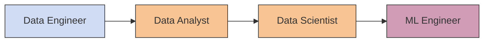

# Parcours Data Science & Machine Learning

La Data Science et le Machine Learning permettent de **transformer des données réelles** en:
* `Produits data (data product)` : applications mobiles, services web, recommandations (Netflix, Amazon), détection de fraude bancaire, optimisation cloud, etc.
* `Analyses de données (data analysis)` : rapports, visualisations, dashboards, communication de résultats, support à la prise de décision.

## Les rôles principaux

- **Data Engineer** : construit et maintient les pipelines et l’infrastructure de données.  
- **Data Analyst** : produit rapports, visualisations et insights à partir des données.  
- **Data Scientist** : combine analyse et modélisation pour créer des modèles prédictifs.  
- **ML Engineer / Researcher** : entraîne, optimise et déploie les modèles en production.  

::: info 💡
Les rôles se chevauchent fortement. Un Data Scientist peut parfois jouer le rôle d’Analyst ou d’ML Engineer selon l’entreprise.
:::

## Le parcours général

1. `Monde réel → Données` : Les données proviennent de capteurs, logs, applications, enquêtes, expériences, simulations → données brutes, hétérogènes, souvent désorganisées

2. `Collecte & Stockage` : Stockage dans bases SQL, fichiers CSV, systèmes cloud ou data lakes → disponibilité, structuration et scalabilité des données

3. `Nettoyage & Organisation` : Traitement des valeurs manquantes, doublons et incohérences. Mise en forme des features et labels pour rendre les données exploitables.

4. `Analyse exploratoire` ([EDA](https://www.ibm.com/fr-fr/think/topics/exploratory-data-analysis)) : Statistiques descriptives et visualisations pour comprendre les données → identifier patterns, corrélations et anomalies avant modélisation → comprendre les données avant d’aller plus loin

5. `Analyse de données` : Production de rapports, dashboards et visualisations pour répondre aux besoins métiers. Communication claire et orientée décision.

6. `Machine Learning` : Entraînement de modèles

7. `Produit Data` : Intégration en applications, services automatisés ou dashboards interactifs. Suivi et monitoring pour garantir robustesse et mise à jour continue.

8. `Retour au monde réel` : Les résultats influencent décisions et actions concrètes. Le cycle recommence avec de nouvelles données générées.